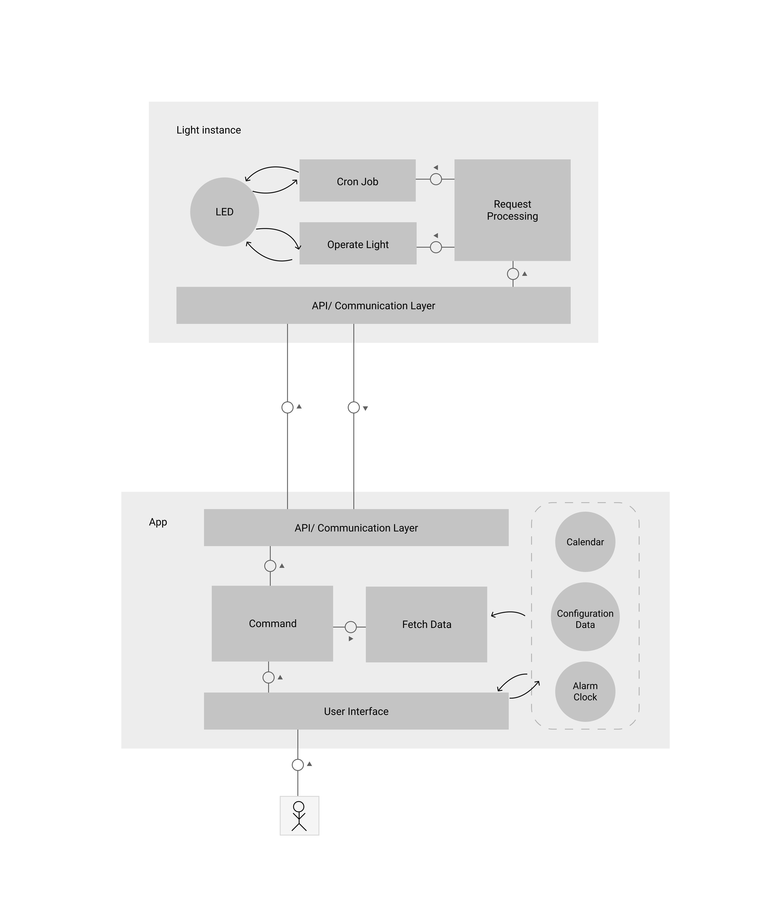

# Index

- [Projekt Outline](#Project-Outline)
- [User Interface](#User-Interface)


#### Teammebers
- Benjamin Bäumler
- Maksim Sandybekov


## Project Outline

### Motivation
Some people close their curtains/shutters when they go to sleep. The reason for doing so varies from person to person.

This in fact reduces the trespass of outside light into the room. Since the sun can potentially act as a natural
alarm-clock, these people mitigate the possibility to be woken up by the sun. The result is a harder or disordet waking process. 

The usage of an smart device that could simulate the sun by activiating at a certain time and alter it's light intensity over time to gradually increase could help to ease the waking process. 

Summarized the main motive for this project lies in the fact that almost everyone (espacially programmers who work late night) had at some point issues with waking up because of closed curtains/shutters.


### Scenario

The app communicates with one or multiple raspberry pi instances that symbolize each a light instance. Through the
app the user is able to configure a sun simulation mode, in which he sets the time or allows the adjustment by 
native alarm clock data. Optionally the user is also able to integrate his calendar with the application and by
doing so configure the sunrise mode by either the alarm clock or calendar dates. 
In addition the application should optionally enable the user to controll the light instance in many ways. Like ...

- Setting light on/of
- Light intensity
- Color

By doing so the wrapped up end-product becomes something like a smart light.


### Technical structure

#### Hardware
Below listed are the main hardware components that are needed to realize this project.

- Raspberry Pi zero W **x1**
- [4 PIN, 12v RGB LED Strip](https://www.leds24.com/RGB-LED-Strips-12V) **x1**
- N-channel MOSFET (e.g. IRLZ34N) **x3**
- Power Supply (12v) **x1**
- DC Power Cable Female Connector Plug **x1**
- Perfboard **x1**


#### Technologies
The Technologies we selected for this project are **react native** as a **cross-platform** framework and mainly **rust** for the backend as well as the hardware components. Because no teammember currently possses an iOS device our main target platform remains android. By Chance we will still try to target iOS as well. 
The android/iOS codebase will interface with the backend through an adequate library.


##### Architecture (System/Software)



### Project details

#### Schedule

| Due                           | Task                                                              |
| ---                           | ---                                                               |
| 25.10.2018                    | Analyze and list hardware and software requirements               |
| 08.11.2018                    | User interface Design                                             |
| 08.11.2018                    | Prototype Software                                                |
| 11.12.2018                    | Wiring of hardware components                                     |
| 11.12.2018                    | Implementation (Core Functionality)                               |
| 10.01.2018                    | Wrap components into and end-product                              |
| 10.01.2019                    | Implementation (Optional Functionality)                           |

#### Complexity
The following aspects of complexity can be identified. The Complexity of software components can
vary depending on usage of libraries and their learning curve, from scratch implementations and also the size and number of seperate parts.

- Hardware complexity (medium)
    - soldering of parts
    - product design/endproduct creation
- Software complexity (easy-hard)
    - Server-Client communication with multiple instances
    - LED strap control
    - Interfacing between rust and android/iOS


#### Risks
- Lack of experience with hardware
- Non standard way to implement app (cross-platform/less support of lecturer)

## User Interface

The current state of the interface design is accessable through below link.

https://www.figma.com/file/RVZd5LnsutkQmoSH1gSq4f1N/MoCo

# Build

https://medium.com/@marekkotewicz/building-a-mobile-app-in-rust-and-react-native-part-1-project-setup-b8dbcf3f539f

https://medium.com/@marekkotewicz/building-a-mobile-app-in-rust-and-react-native-part-2-hello-world-60970a7d194a

Install Android NDK toolchains with the following command:
```
${NDK_HOME}/build/tools/make_standalone_toolchain.py --api 16 --arch x86 --install-dir NDK/x86
${NDK_HOME}/build/tools/make_standalone_toolchain.py --api 16 --arch arm --install-dir NDK/arm
${NDK_HOME}/build/tools/make_standalone_toolchain.py --api 16 --arch arm64 --install-dir NDK/arm64
```

Install Rust and run:
```
rustup target add aarch64-linux-android
rustup target add armv7-linux-androideabi
rustup target add i686-linux-android
```

Compile Project with:
```
make android
```

And run with:
```
make run-android
```

Not sure if this step is need..
```
react-native bundle --platform android --dev false --entry-file index.js --bundle-output android/app/src/main/assets/index.android.bundle --assets-dest android/app/src/main/res
```
